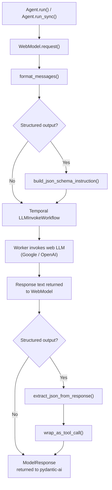

# Architecture

This page describes the internal mechanics of `pydantic-ai-web-models`: how a request flows
from your application code through to the Temporal workflow, how messages are formatted, how
structured output is extracted, and what the current limitations are.

## Request Flow

Every call to `agent.run()` or `agent.run_sync()` triggers the following sequence:



1. pydantic-ai calls `WebModel.request()` with the list of `ModelMessage` objects for the
   current conversation turn.
2. `format_messages()` flattens the message list into a single text prompt (see
   [Message Formatting](#message-formatting) below).
3. If `output_type` is set, a JSON schema instruction is appended to the prompt.
4. The prompt and the model identifier (`provider:model_name`) are submitted to the Temporal
   `LLMInvokeWorkflow` via the Temporal client.
5. The workflow executes on the worker, which invokes the web-based LLM and returns the
   response text.
6. For plain text requests, the response text is wrapped in a `ModelResponse` and returned.
7. For structured output, the JSON extraction pipeline runs first, then the extracted object
   is wrapped as a tool-call response so pydantic-ai can deserialise it.

## Message Formatting

The `format_messages()` function converts pydantic-ai's typed message list into a single
string that the Temporal workflow can consume.

**Single message (no history)**

When there is only one user message and no conversation history, the prompt is sent as-is
with no speaker prefix:

```
What is the capital of France?
```

**Multi-turn conversation**

When `message_history` is present, each turn is labelled with a `User:` or `Assistant:` prefix:

```
User: What are the three laws of thermodynamics?
Assistant: The three laws are: ...
User: Can you explain the second one in simpler terms?
```

**System prompts**

If the agent has one or more system prompts, they are concatenated and prepended to the
formatted prompt using the following separator:

```
**System Instructions:**
You are a helpful cooking assistant. Keep answers concise.
---
User: How do I make scrambled eggs?
```

**Binary content**

Any binary content parts in messages (images, file attachments) are silently skipped during
formatting. Only text parts are included in the prompt.

## Structured Output Pipeline

When `output_type` is set on an `Agent`, the library appends a JSON schema instruction to the
end of the formatted prompt before sending it to Temporal:

```
...

Respond with a JSON object matching this schema:
{"type": "object", "properties": {...}, "required": [...]}
Do not include any text outside the JSON object.
```

When the response arrives, three extraction strategies are attempted in order:

| Strategy | Description |
|---|---|
| 1. Direct parse | `json.loads(response_text)` on the full response as-is. |
| 2. Strip markdown fences | Remove ` ```json ` / ` ``` ` wrappers and retry `json.loads`. |
| 3. Outermost braces | Find the first `{` and last `}` in the string, extract that substring, and retry `json.loads`. |

If all three strategies fail, `JSONParseError` is raised with `raw_text` set to the full LLM
response. If any strategy succeeds, the resulting dict is validated against the Pydantic model
and then wrapped in a tool-call response object for pydantic-ai to unwrap.

## Token Counting

The library does not have access to the actual token counts used by the web-based LLM (the
Temporal workflow API does not return this information). Token usage is therefore **approximated**
using the formula:

```python
tokens = len(text) // 4
```

This is a rough heuristic (approximately 4 characters per token for English text). The values
are reported in `result.usage()` but should not be relied upon for precise billing or quota
calculations.

## Limitations

| Limitation | Details |
|---|---|
| **No streaming** | Responses are returned in full after the workflow completes. Incremental / streaming output is not supported. |
| **No tool / function calls** | The library only supports text and structured output. pydantic-ai tool calls are not forwarded to the LLM. |
| **No binary content** | Images and file attachments in messages are silently skipped. Vision and document understanding are not available. |
| **Approximate token counts** | Usage figures reported via `result.usage()` are estimated as `len(text) // 4`. |
| **Requires Temporal infrastructure** | A running Temporal server and a compatible worker (`LLMInvokeWorkflow` on `ai-worker-task-queue`) are required. There is no fallback. |
